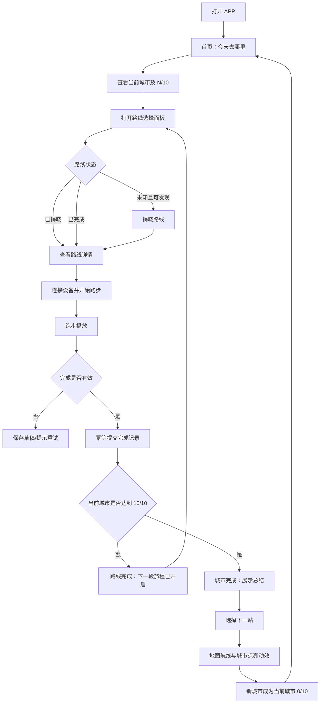
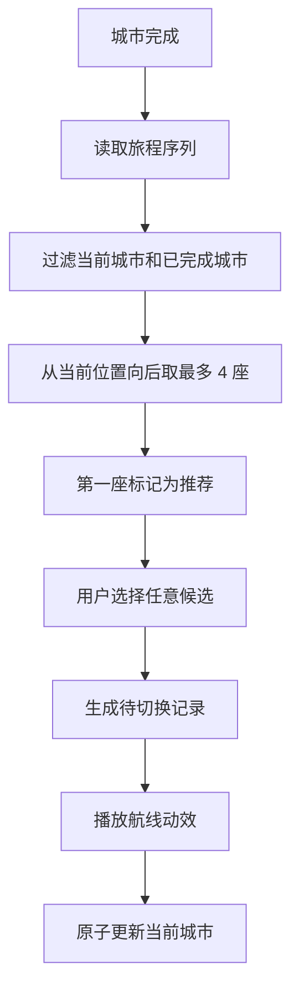
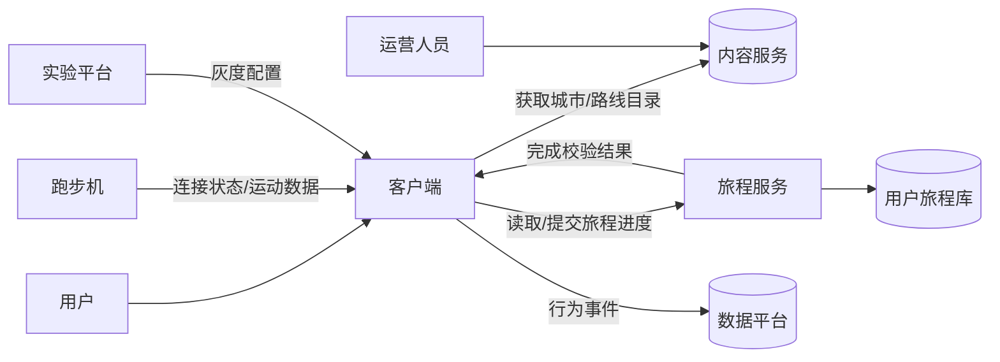
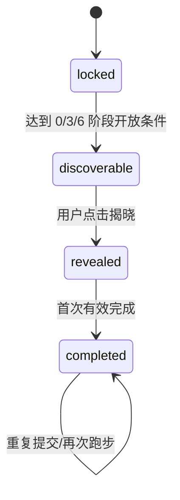
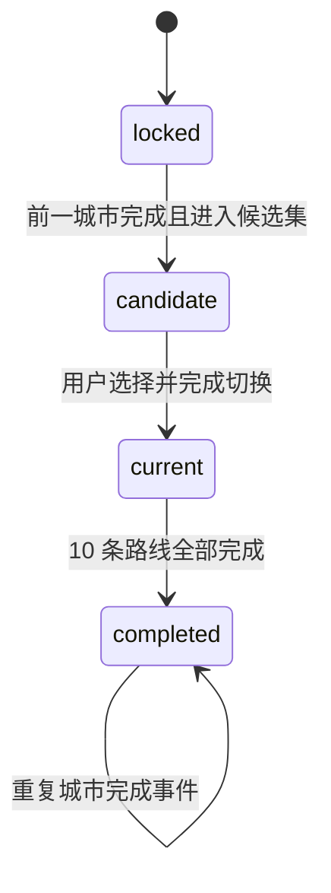
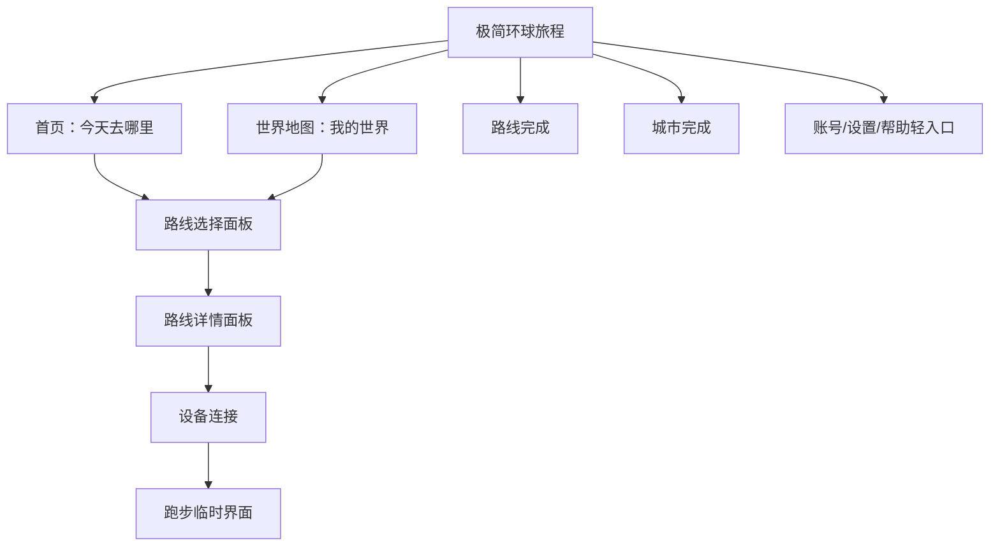

# MOVEVI 木卫六极简环球旅程产品需求文档（PRD）

版本号：V1.0.0  
文档状态：评审稿  
更新日期：2026/09/14

| 版本 | 时间 | 修订人 | 备注 |
|---|---|---|---|
| V1.0.0 | 2026/09/14 | 产品团队 / Codex | 根据《木卫六产品玩法极简化方案》整理首版评审稿 |

> 本文档中的 **[假设]** 为原方案未明确、为形成可执行需求而补充的默认方案；**[待确认]** 必须在对应阶段评审中拍板。原方案的核心命题仍需灰度验证：把 200 条路线包装成一场环球旅行，能否驱动用户持续完成路线。

---

# 一、概述（为什么做）

## 1.1 产品概述及目标

### 1.1.1 背景介绍

木卫六已有约 20 座城市、200 多条路线和 3200 多分钟运动内容，但老版本同时承载活动、积分、光迹值、金币、任务、排行榜、勋章、抽奖和签到等机制。用户打开 APP 后需要理解多套规则，无法快速判断“今天跑哪里”和“跑完后做什么”。

本版本将产品主线收束为环球城市旅程：用户完成一条路线，看到下一段旅程；完成一座城市，选择下一站。通过完成欲、好奇心和旅行欲驱动长期运动，而非依赖复杂虚拟奖励。

当前用户替代方案是：从老版多个入口寻找路线，完成后查看奖励、任务或活动反馈，再自行决定下一次运动内容。该方案信息密度高、路径不统一，增加选择成本和机制学习成本。

### 1.1.2 产品概述

“极简环球旅程”是 MOVEVI 面向智能跑步机用户的城市运动内容主模式。一级体验由“今天去哪里、今天跑哪一条、下一条是什么、下一座城市去哪里”四个问题组成，通过世界地图、城市进度、未知路线和城市完成仪式形成连续旅程。

### 1.1.3 产品目标

#### 业务目标

| 目标 | 指标 | V1.0 建议目标 | 观察周期 |
|---|---|---:|---|
| 验证环球旅程能否驱动运动 | 周旅程推进率 | **[待确认]** 灰度组较基线提升 ≥15% | 上线后 4 周 |
| 降低首次决策成本 | 首页进入跑步的中位时长 | **[待确认]** ≤60 秒 | 上线后 2 周 |
| 提升内容完成度 | 新路线完成率 | **[待确认]** 灰度组较基线提升 ≥10% | 上线后 4 周 |
| 形成连续使用 | 次周旅程回访率 | **[待确认]** 灰度组较基线提升 ≥8% | 上线后 6 周 |
| 控制体验风险 | 跑步记录成功同步率 | ≥99.5% | 持续监控 |

**北极星指标：周旅程推进率**  
计算口径：当周至少完成 1 条此前未完成路线的用户数 ÷ 当周进入环球旅程首页的用户数。重复跑已完成路线不计为“推进”。

#### 用户目标

| 目标用户 | 用户目标 | 衡量指标 |
|---|---|---|
| 已有 MOVEVI 用户 | 打开 APP 即知道今天应继续哪座城市 | 首页→路线选择转化率、决策时长 |
| 新用户 | 无需学习复杂机制即可开始第一段旅程 | 首次路线启动率、首次完成率 |
| 连续运动用户 | 明确距离城市完成还差几条路线 | 城市阶段推进率、城市完成率 |
| 内容探索型用户 | 对未知路线和下一座城市保持期待 | 未知路线揭晓率、候选城市选择率 |

### 1.1.4 目标用户

| 角色 | 描述 | 核心诉求 |
|---|---|---|
| 普通跑者 | 已注册并绑定或可连接 MOVEVI 跑步机 | 快速开始、稳定记录、明确下一步 |
| 新手跑者 | 首次进入或尚未完成首条路线 | 低学习成本、清晰引导 |
| 回访跑者 | 已有城市和路线完成记录 | 延续原进度、避免资产丢失 |
| 运营人员 | 配置城市、路线、开放关系和灰度范围 | 可控发布、数据验证、可回滚 |

## 1.2 名词说明

| 名词 | 说明 |
|---|---|
| 城市旅程 | 一座城市下由 10 条路线组成的完整探索单元 |
| 当前城市 | 用户当前正在推进的唯一城市 |
| 下一站候选 | 当前城市完成后可选择的后续城市，最多 4 座 |
| 未知路线 | 已进入可发现阶段，但尚未由用户揭晓真实名称的路线 |
| 可发现 | 用户可以点击揭晓并进入详情的路线状态 |
| 已揭晓 | 已显示真实名称与详情、尚未完成的路线状态 |
| 已完成 | 已产生有效完成记录的路线或城市状态 |
| 旅程推进 | 首次完成一条未完成路线，或完成并切换一座城市 |
| 城市完成仪式 | 第 10 条路线完成后的总结、选城和地图航线动效 |
| 极简实验版 | 用于验证环球旅程假设的独立灰度版本/模式 |

## 1.3 角色及权限

| 角色 | 权限范围 | 数据范围 |
|---|---|---|
| 游客 | 查看演示地图、城市和公开路线信息；不可同步正式记录 | 演示数据 |
| 登录用户 | 连接设备、开始跑步、更新本人旅程、查看本人历史 | 仅本人数据 |
| 内容运营 | 城市/路线内容维护、开放状态配置 | 全部内容数据，不含用户敏感数据 |
| 产品/实验管理员 | 配置灰度人群、实验版本、回滚开关 | 实验配置及脱敏指标 |

## 1.4 文档阅读对象

| 对象 | 关注内容 |
|---|---|
| 产品 | 产品范围、状态规则、待确认项、实验指标 |
| UI/UX | 四个核心页面、路线分层面板、完成仪式、全局语言 |
| 客户端研发 | 页面流程、状态机、设备异常、数据同步 |
| 服务端研发 | 旅程进度、幂等、候选算法、内容接口 |
| 测试 | 阈值、异常流程、幂等、灰度兼容、验收标准 |
| 数据分析 | 埋点、指标口径、实验判定 |
| 内容运营 | 20 城/200 路线内容完整度与发布配置 |

---

# 二、产品描述（做什么）

## 2.1 产品需求描述

### 2.1.1 本期做什么

- 以“下一站”为唯一一级主线，建立世界地图、当前城市、路线进度和城市切换闭环。
- 每座城市固定 10 条路线，按完成 3/6/10 条划分开放阶段。
- 用户可在当前阶段内任意选择路线，不要求按编号顺序完成。
- 未完成且可发现的路线先显示“未知路线”，点击后揭晓真实内容。
- 跑完普通路线进入“路线完成”；跑完第 10 条进入“城市完成”。
- 城市完成后展示极简总结，从后续候选中选择下一站，并播放地图航线动效。
- 只突出城市、路线和景点三个数字，其中景点为弱信息。
- 保留账号、设备连接、设置、帮助等完成主流程所需能力，但降为轻量入口。

### 2.1.2 本期不做什么

- 不在极简实验版一级入口展示积分、金币、复杂任务、排行榜、勋章体系、抽奖或连续签到。
- 不新增社交关系、组队、对战、装备养成和虚拟商城机制。
- 不在路线完成页发放需要用户理解的新虚拟货币。
- 不在 V1.0 新增城市订阅、付费内容和动态路线生成。

> **[待确认-阻塞开发]** “其他老版功能保留”与 PDF 的“全部砍掉”存在冲突。默认建议：旧功能代码和历史数据保留以支持回滚，但极简实验版不显示其一级入口，也不在跑步完成链路中弹出奖励；非灰度用户继续使用老版。

### 2.1.3 内容范围

**[假设]** V1.0 使用 20 城、每城 10 条、共 200 条路线：杭州、北京、上海、西安、东京、巴黎、伦敦、纽约、悉尼、里约热内卢、开罗、曼谷、孟买、新加坡、莫斯科、洛杉矶、罗马、迪拜、柏林、多伦多。

## 2.2 产品整体流程

### 2.2.1 主流程

### 2.2.2 城市候选子流程

### 2.2.3 数据流图

### 2.2.4 路线状态转换

### 2.2.5 城市状态转换

## 2.3 全局说明

### 2.3.1 全局状态规则

1. 同一用户同一时刻只能有一座 `current` 城市。
2. 城市完成以 10 个唯一有效路线 ID 为准，不以提交次数为准。
3. 路线重复完成可生成新的运动记录，但首次完成进度、景点发现数和城市完成事件不得重复累计。
4. 路线开放阈值：完成 0-2 条开放第 1 组 3 条；完成 3-5 条开放前 6 条；完成 6-9 条开放全部 10 条。
5. 用户可完成当前阶段内任意已揭晓路线，不强制 1→2→3 顺序。
6. 已完成城市允许查看和重复跑路线，但不得重新成为未完成城市。
7. 切换城市必须以服务端成功确认为准；动效失败不影响已确认的业务状态。
8. 语言统一使用“旅程、下一段、下一站、已完成”，避免使用“打怪、解锁奖励、领取金币”。

### 2.3.2 全局异常处理

| 异常场景 | 处理方式 | 提示文案 |
|---|---|---|
| 网络不可用 | 保留本地页面状态，支持重试；跑步记录进入待同步队列 | “网络暂时不可用，跑步记录将在恢复后同步” |
| 内容加载失败 | 展示最近缓存内容；无缓存时显示重试页 | “城市内容加载失败，请重试” |
| 设备未连接 | 路线可浏览，开始按钮引导连接设备 | “连接跑步机后即可开始旅程” |
| 设备中途断连 | 暂停计时，保留已接收数据，提供重连/结束 | “跑步机连接已断开，正在尝试重连” |
| 完成提交超时 | 禁止重复生成业务记录，按幂等键查询结果 | “正在确认本次旅程，请勿重复操作” |
| 路线不存在/下架 | 返回路线列表并刷新目录 | “这段旅程暂时无法开始” |
| 当前城市不一致 | 重新拉取服务端状态并覆盖客户端过期状态 | “旅程进度已更新” |
| 所有城市已完成 | 展示环球完成态，不再生成候选 | “你已完成本期环球旅程” |

### 2.3.3 全局交互

| 场景 | 规则 |
|---|---|
| 主行动 | 每个页面只保留一个视觉最强的主按钮 |
| 返回 | 弹层返回来源页；跑步中返回需二次确认是否结束 |
| 加载 | 首屏使用稳定骨架，不改变核心控件位置 |
| 提交 | 首次点击后按钮置灰并显示处理中，防止重复提交 |
| 成功 | 业务状态先确认，再播放完成动效 |
| 失败 | 保留用户已输入/已跑数据并提供明确重试操作 |
| 动效 | 支持 `prefers-reduced-motion`；减少动效时直接呈现最终状态 |
| 无障碍 | 交互热区不小于 44×44px，焦点可见，弹层具备焦点约束和 Escape 关闭能力 |

## 2.4 产品版本规划

| 版本 | 范围 | 计划时间 | 状态 |
|---|---|---|---|
| V1.0 极简灰度版 | 四个核心页面、路线三阶段、跑步闭环、城市完成选站、埋点 | **[待确认]** 建议 6-8 周 | 待评审 |
| V1.1 验证增强 | 根据数据调整候选算法、内容节奏、完成仪式和召回 | **[待确认]** V1.0 后 4 周 | 规划中 |
| V1.2 内容飞轮 | 订阅、新城市、新路线、运营配置增强 | 验证成立后 | 远期 |

## 2.5 产品框架

## 2.6 功能清单

| 模块 | 功能 | 优先级 | 版本 | 说明 |
|---|---|---:|---|---|
| 首页 | 当前城市与下一步 | P0 | V1.0 | 展示城市、N/10 和唯一主按钮 |
| 世界地图 | 20 城状态展示 | P0 | V1.0 | 完成、当前、候选、锁定 |
| 城市路线 | 三阶段开放 | P0 | V1.0 | 3/6/10 阈值 |
| 城市路线 | 未知路线揭晓 | P0 | V1.0 | 可发现后点击揭晓 |
| 路线详情 | 内容与计划数据 | P0 | V1.0 | 地标、里程、时长、热量、简介 |
| 设备 | 连接与断连恢复 | P0 | V1.0 | 跑步前检查、跑步中重连 |
| 跑步 | 播放、暂停、继续、结束 | P0 | V1.0 | 沉浸式临时界面 |
| 路线完成 | 记录及下一段引导 | P0 | V1.0 | 普通路线完成分支 |
| 城市完成 | 城市总结 | P0 | V1.0 | 第 10 条路线完成分支 |
| 下一站 | 候选、推荐、切换动效 | P0 | V1.0 | 最多 4 座候选 |
| 账号与设置 | 账号、隐私、帮助 | P1 | V1.0 | 顶部轻入口 |
| 内容运营 | 城市与路线配置 | P1 | V1.1 | 发布、下架、排序 |

---

# 三、功能需求（怎么做）

## 3.1 首页：今天去哪里

### 3.1.1 描述

首页只回答当前目的地和下一步行动，不展示功能宫格、活动流或多标签导航。

### 3.1.2 用户故事

作为跑者，我希望打开 APP 后立即看到当前城市和剩余路线，以便不做额外决策就能继续运动。

### 3.1.3 前置条件

- 城市目录已加载或存在本地缓存。
- 用户旅程进度已加载；新用户使用初始化城市。

### 3.1.4 后置条件

- 点击主按钮后打开当前城市路线面板。
- 点击地图入口后进入“我的世界”。

### 3.1.5 界面及交互

| 元素 | 类型 | 默认/规则 | 操作反馈 |
|---|---|---|---|
| 页面问题 | 标题 | “今天去哪里？” | 无 |
| 当前城市 | 主信息 | 城市中文名、英文名 | 无 |
| 城市进度 | 数字/进度条 | `completed/10` | 使用真实进度 |
| 剩余提示 | 弱文本 | “还有 N 段旅程等待发现” | N=10-completed |
| 继续城市 | 主按钮 | “继续{城市}旅程” | 打开路线面板 |
| 三个数字 | 弱统计 | 城市、当前城市路线、景点 | 景点最低视觉优先级 |
| 我的世界 | 次按钮 | 地图图标+文字 | 进入世界地图 |
| 设备/个人 | 顶部轻入口 | 显示连接状态点 | 打开轻量面板 |

### 3.1.6 异常/分支流程

- 无进度的新用户：**[待确认]** 默认建议从北京 0/10 开始，并展示 3 条可发现路线。
- 当前城市已完成但未选下一站：直接进入城市完成页。
- 进度接口与本地缓存冲突：以服务端版本号较新的记录为准。

## 3.2 世界地图：我的世界

### 3.2.1 描述

展示全部城市的位置和旅程状态，让用户看到已走过的世界、当前所在位置和未来方向。

### 3.2.2 用户故事

作为跑者，我希望看到所有城市和自己的足迹，以便感受到旅程规模和持续推进的价值。

### 3.2.3 城市状态视觉

| 状态 | 视觉 | 是否可点击 | 点击结果 |
|---|---|---:|---|
| completed | 品牌蓝/青绿色点亮，带完成标识 | 是 | 查看已完成路线 |
| current | 高亮主色、外圈呼吸或定位标识 | 是 | 打开当前城市路线 |
| candidate | **[假设]** 陶土/金色强调 | 否，城市完成页可选择 | 显示候选标签 |
| locked | 低对比描边点 | 否 | 无或显示“等待探索” |

### 3.2.4 规则

- 全部 20 座城市可见，但锁定城市不可进入路线详情。
- 地图不展示 200 条路线节点。
- 当前城市必须有唯一文本标签，避免只依赖颜色区分。
- 城市完成航线动效从旧城市移动到新城市，业务状态切换完成后返回首页。

## 3.3 城市路线选择与揭晓

### 3.3.1 描述

以分层面板展示当前城市进度和路线状态。路线可以自由选择，但受到阶段开放限制。

### 3.3.2 用户故事

作为跑者，我希望在当前可选范围内自主挑选路线，以便避免因为不喜欢某条路线而卡住旅程。

### 3.3.3 前置条件

- 当前城市状态为 `current`；已完成城市仅允许回看和重跑。
- 城市路线数据完整且版本可用。

### 3.3.4 路线开放规则

| 已完成数量 | 开放范围 | 结果 |
|---:|---|---|
| 0-2 | 路线组 1，共 3 条 | 组内未揭晓路线显示“未知路线” |
| 3-5 | 路线组 1-2，共 6 条 | 新开放 3 条变为可发现 |
| 6-9 | 全部 10 条 | 最后 4 条变为可发现 |
| 10 | 全部已完成 | 进入城市完成流程 |

### 3.3.5 路线元素

| 元素 | 状态规则 | 操作反馈 |
|---|---|---|
| 路线编号 | 始终显示 | 用于区分路线，不代表强制顺序 |
| 路线名称 | completed/revealed 显示；discoverable 显示“未知路线” | 点击未知路线后揭晓 |
| 简要信息 | 揭晓后显示里程和地标 | 点击进入详情 |
| 锁定提示 | locked 显示“完成当前阶段后开放” | 不可点击 |
| 完成标识 | completed 显示勾选 | 允许回看/重跑 |

### 3.3.6 异常/分支流程

- 揭晓提交失败：客户端保持“未知路线”，提供重试；不得出现半揭晓状态。
- 路线下架：若未完成则从可选组移除并由运营补充等价路线；若已完成则保留历史快照。
- 阶段内路线不足：阻止内容版本发布并告警运营。

## 3.4 路线详情与开始跑步

### 3.4.1 描述

展示用户做出开始决定所需的最少信息，并完成设备状态检查。

### 3.4.2 用户故事

作为跑者，我希望快速确认距离、时间和途经地标，然后一键开始运动。

### 3.4.3 界面及交互

| 元素 | 类型 | 必填 | 规则 |
|---|---|---:|---|
| 路线名称 | 标题 | 是 | 使用揭晓后的真实名称 |
| 地标 | 文本 | 是 | 1-5 个，超长折叠 |
| 距离 | 数字 | 是 | km，1 位小数 |
| 预计时长 | 数字 | 是 | 分钟 |
| 预计热量 | 数字 | 是 | kcal |
| 简介 | 正文 | 是 | 建议 40-120 字 |
| 开始旅程 | 主按钮 | 是 | 设备在线时直接开始；离线时进入连接流程 |

### 3.4.4 异常/分支流程

- 设备已连接：点击后 1 秒内进入跑步界面。
- 设备未连接：按钮文案变为“连接跑步机并开始”。
- 用户取消连接：返回详情，不丢失路线选择。
- 已完成路线：允许“再跑一次”，但不重复增加旅程进度。

## 3.5 跑步播放

### 3.5.1 描述

跑步播放是沉浸式临时界面，不计入四个一级页面。

### 3.5.2 用户故事

作为跑者，我希望跑步中只看到距离、时间、配速和必要控制，以便专注运动。

### 3.5.3 核心交互

| 元素 | 规则 |
|---|---|
| 运动画面 | 使用路线视频/城市图像，不能阻碍数据可读性 |
| 距离 | 主指标，实时更新 |
| 时间、配速、热量 | 次指标，实时更新 |
| 暂停/继续 | 一个主控制，状态文案同步变化 |
| 结束 | 次控制；点击后确认或进入简洁结果页 |
| 返回 | 未结束时触发二次确认 |

### 3.5.4 有效完成规则

**[待确认]** 默认建议同时满足以下条件：

- 跑步机产生有效运动数据；
- 实际距离达到计划距离的 90%，或内容播放达到 90%；
- 完成事件包含用户、设备、路线和幂等键；
- 服务端校验通过。

演示/测试环境可通过显式 Demo 开关使用路线计划数据完成，不得进入生产统计。

### 3.5.5 异常/分支流程

| 场景 | 处理 |
|---|---|
| 暂停超过 30 分钟 | **[待确认]** 建议提示是否结束，保留本次草稿 |
| 设备断连 | 自动暂停并重连，恢复后继续累计 |
| APP 进入后台 | 保持设备会话；返回时根据设备时间校正 |
| APP 被杀进程 | 下次启动检测未完成会话，提示恢复或结束 |
| 数据明显异常 | 标记待审核，不推进首次完成状态 |

## 3.6 路线完成

### 3.6.1 描述

完成第 1-9 条新路线后展示极简结果和城市新进度，不发放需要额外理解的虚拟奖励。

### 3.6.2 界面及交互

| 元素 | 规则 |
|---|---|
| 标题 | “路线完成” |
| 路线信息 | 路线名、城市名 |
| 运动结果 | 本次距离、时间；热量可作为弱信息 |
| 新进度 | `{城市} N/10` |
| 状态文案 | “下一段{城市}旅程已开启” |
| 主按钮 | “发现下一段旅程”，返回路线面板 |
| 次入口 | “查看我的世界” |

### 3.6.3 后置条件

- 首次完成：完成路线 ID 加入城市进度，记录景点发现，检查 3/6/10 阈值。
- 重复完成：保存新的运动记录，城市进度不变。
- 完成达到 10 条：不展示路线完成页，直接进入城市完成页。

## 3.7 城市完成与下一站

### 3.7.1 描述

第 10 条路线完成后，以城市总结、候选选择和地图航线形成核心奖励仪式。

### 3.7.2 用户故事

作为跑者，我希望看到自己完成整座城市的成果并选择下一站，以便获得旅程推进的满足感和期待感。

### 3.7.3 城市总结

| 元素 | 规则 |
|---|---|
| 标题 | “{城市}，已完成” |
| 说明 | “你已经跑过这座城市” |
| 路线总数 | 固定显示 10 |
| 总里程 | 10 条路线计划里程之和；另可查看实际累计 |
| 总时长 | 10 条首次完成记录时长之和 |
| 景点数 | 10 条路线去重后的景点数量 |
| 候选问题 | “下一站，你想去哪里？” |

### 3.7.4 候选计算

**[假设]** 使用确定性基础序列：  
北京 → 上海 → 东京 → 巴黎 → 纽约 → 伦敦 → 罗马 → 柏林 → 莫斯科 → 迪拜 → 开罗 → 孟买 → 曼谷 → 新加坡 → 悉尼 → 洛杉矶 → 多伦多 → 里约热内卢 → 杭州 → 西安。

- 从当前城市在序列中的位置向后查找；
- 过滤当前城市和已完成城市；
- 取最多 4 座作为候选；
- 第一座标记为“推荐下一站”；
- 用户可以选择其余任意候选；
- 若不足 4 座则展示实际数量；若为 0 则进入环球完成态。

### 3.7.5 切换流程

1. 点击候选城市后立即锁定重复点击。
2. 服务端创建城市切换事务并返回成功。
3. 播放旧城市→新城市航线动画和目的地标记。
4. 动画结束后将新城市设置为 `current` 并返回首页。
5. 减少动效模式下直接淡入新城市首页。

### 3.7.6 异常/分支流程

- 候选已失效：刷新候选并提示“可选目的地已更新”。
- 提交成功但动画中断：重新进入 APP 时直接显示新当前城市。
- 重复切换请求：相同幂等键返回同一结果，不产生多个当前城市。

## 3.8 设备与个人轻入口

### 3.8.1 描述

在不破坏主线的前提下提供设备状态、账号、设置和帮助。

### 3.8.2 功能范围

| 功能 | V1.0 要求 |
|---|---|
| 设备连接状态 | 显示在线/离线、连接/断开 |
| 账号 | 昵称、账号状态、登录入口 |
| 设置 | 隐私、通知、减少动效 |
| 帮助 | 连接说明、跑步问题、反馈入口 |
| 老版资产 | **[待确认]** 默认不在极简模式显示，但数据不删除 |

## 3.9 核心数据字典

### 3.9.1 城市 `journey_city`

| 字段名 | 类型 | 必填 | 说明 | 示例值 |
|---|---|---:|---|---|
| city_id | String(32) | 是 | 城市唯一 ID | `tokyo` |
| name | String(32) | 是 | 中文名 | `东京` |
| english_name | String(64) | 是 | 英文名 | `Tokyo` |
| country | String(64) | 是 | 国家/地区 | `日本` |
| latitude | Decimal | 是 | 纬度 | `35.6762` |
| longitude | Decimal | 是 | 经度 | `139.6503` |
| cover_url | String(512) | 是 | 城市封面 | `https://...` |
| description | String(300) | 是 | 城市简介 | `传统与现代交织...` |
| sequence_no | Integer | 是 | 基础旅程序号 | `3` |
| publish_status | Enum | 是 | draft/published/offline | `published` |
| content_version | Integer | 是 | 内容版本 | `7` |

### 3.9.2 路线 `journey_route`

| 字段名 | 类型 | 必填 | 说明 | 示例值 |
|---|---|---:|---|---|
| route_id | String(64) | 是 | 全局唯一 ID | `tokyo-route-07` |
| city_id | String(32) | 是 | 所属城市 | `tokyo` |
| route_no | Integer | 是 | 城市内编号 1-10 | `7` |
| stage | Integer | 是 | 开放阶段 1/2/3 | `3` |
| name | String(80) | 是 | 路线名称 | `皇居绿环` |
| landmarks | Array<String> | 是 | 途经地标 | `[皇居, 千鸟渊]` |
| distance_km | Decimal | 是 | 计划里程 | `4.2` |
| duration_min | Integer | 是 | 预计时长 | `32` |
| calories_kcal | Integer | 是 | 预计热量 | `280` |
| spot_ids | Array<String> | 是 | 景点 ID | `[spot_101]` |
| intro | String(300) | 是 | 路线简介 | `沿皇居外苑...` |
| media_url | String(512) | 否 | 跑步内容地址 | `https://...` |
| publish_status | Enum | 是 | draft/published/offline | `published` |

### 3.9.3 用户城市进度 `user_city_journey`

| 字段名 | 类型 | 必填 | 说明 | 示例值 |
|---|---|---:|---|---|
| user_id | String(64) | 是 | 用户 ID | `u_3026` |
| city_id | String(32) | 是 | 城市 ID | `tokyo` |
| city_status | Enum | 是 | locked/candidate/current/completed | `current` |
| completed_route_ids | Array<String> | 是 | 去重后的已完成路线 | `[tokyo-route-01]` |
| revealed_route_ids | Array<String> | 是 | 已揭晓路线 | `[tokyo-route-07]` |
| first_started_at | DateTime | 否 | 首次开始时间 | `2026-09-01T08:00:00+08:00` |
| completed_at | DateTime | 否 | 城市完成时间 | `null` |
| version | Integer | 是 | 乐观锁版本 | `6` |

### 3.9.4 跑步记录 `route_run_record`

| 字段名 | 类型 | 必填 | 说明 | 示例值 |
|---|---|---:|---|---|
| run_id | String(64) | 是 | 跑步记录 ID/幂等键 | `run_uuid` |
| user_id | String(64) | 是 | 用户 ID | `u_3026` |
| device_id | String(64) | 否 | 设备 ID | `mv_t01` |
| city_id | String(32) | 是 | 城市 ID | `tokyo` |
| route_id | String(64) | 是 | 路线 ID | `tokyo-route-07` |
| started_at | DateTime | 是 | 开始时间 | `2026-09-14T10:00:00+08:00` |
| ended_at | DateTime | 是 | 结束时间 | `2026-09-14T10:32:00+08:00` |
| distance_km | Decimal | 是 | 实际里程 | `4.18` |
| duration_sec | Integer | 是 | 实际时长 | `1920` |
| calories_kcal | Integer | 是 | 实际消耗 | `276` |
| completion_status | Enum | 是 | valid/invalid/pending | `valid` |
| sync_status | Enum | 是 | pending/synced/failed | `synced` |

---

# 四、非功能需求（注意事项）

## 4.1 安全与合规

| 需求 | 说明 |
|---|---|
| 传输安全 | 正式环境全链路 HTTPS/TLS；设备通信使用公司安全协议 |
| 数据最小化 | 只采集完成旅程所需的账号、设备和运动数据 |
| 敏感数据 | 运动与设备数据按敏感个人信息标准处理，展示前脱敏 |
| 用户授权 | 首次采集运动数据前取得明确授权，并提供撤回与删除入口 |
| 权限隔离 | 用户只能读取本人旅程；运营后台采用 RBAC |
| 日志安全 | 不在客户端日志记录手机号、令牌或完整设备标识 |
| 合规 | 遵循《个人信息保护法》及公司隐私规范 |

## 4.2 统计需求（埋点）

| 事件名 | 触发时机 | 关键属性 | 用途 |
|---|---|---|---|
| journey_home_view | 首页完成展示 | user_id_hash, current_city_id, completed_count, experiment_group | 首页访问与分组 |
| journey_primary_click | 点击继续当前城市 | current_city_id, completed_count | 首页转化 |
| world_map_view | 打开世界地图 | completed_city_count | 地图使用率 |
| route_list_view | 打开路线面板 | city_id, completed_count, open_limit | 阶段漏斗 |
| unknown_route_reveal | 揭晓未知路线成功 | city_id, route_id, stage | 好奇心验证 |
| route_detail_view | 路线详情展示 | city_id, route_id, route_status | 内容吸引力 |
| run_start | 跑步有效开始 | route_id, device_connected, source | 开跑转化 |
| run_pause | 暂停 | route_id, elapsed_sec | 中断分析 |
| run_device_disconnect | 设备断连 | route_id, elapsed_sec, error_code | 稳定性 |
| run_complete_submit | 用户提交完成 | route_id, distance, duration | 完成漏斗 |
| run_complete_result | 服务端返回完成结果 | valid, is_first_completion, latency_ms | 有效完成率 |
| route_complete_view | 路线完成页展示 | city_id, completed_count | 推进结果 |
| city_complete_view | 城市完成页展示 | city_id, total_days, total_runs | 城市完成率 |
| next_city_select | 选择候选城市 | from_city_id, to_city_id, candidate_index, recommended | 候选偏好 |
| city_switch_result | 城市切换结果 | from_city_id, to_city_id, success, latency_ms | 切换可靠性 |
| journey_error | 主流程异常 | page, action, error_code, network_type | 异常监控 |

### 4.2.1 指标口径

- 首页→开跑转化率：看到首页后 30 分钟内产生 `run_start` 的用户数 ÷ `journey_home_view` 用户数。
- 新路线完成率：产生 `run_start` 的未完成路线数中，最终 `valid=true` 的比例。
- 城市完成率：进入城市 0/10 的用户中，在观察窗口内达到 10/10 的比例。
- 次周旅程回访率：本周有首次路线完成的用户，在下周再次产生 `journey_home_view` 的比例。
- 严禁将演示完成记录计入正式指标。

## 4.3 性能与稳定性

| 指标 | 要求 |
|---|---|
| 首页可交互时间 | P75 ≤2.5 秒（中端 Android、4G） |
| 路线面板打开 | 本地数据 ≤300ms；接口数据 P95 ≤1s |
| 完成提交接口 | P95 ≤1.5s，P99 ≤3s |
| 设备断连发现 | ≤3 秒 |
| 完成同步成功率 | ≥99.5% |
| 崩溃率 | Crash-free sessions ≥99.8% |
| 地图交互帧率 | 主流设备 ≥45fps；低端设备提供静态降级 |
| 动效降级 | 减少动效开启时不播放航线移动和印章缩放 |

## 4.4 数据存储与生命周期

| 数据 | 生命周期 | 规则 |
|---|---|---|
| 用户旅程进度 | 账号存续期间 | 支持导出和删除，删除需二次确认 |
| 跑步记录 | **[待确认]** 建议账号存续期间 | 修改需保留审计记录 |
| 设备故障日志 | **[假设]** 30 天 | 到期自动清理 |
| 产品分析明细 | **[假设]** 180 天 | 使用匿名/散列用户标识 |
| 内容版本 | 长期 | 已完成记录保留内容快照 |

核心唯一约束：

- `journey_city.city_id` 唯一；
- `journey_route.route_id` 全局唯一；
- `(city_id, route_no)` 唯一；
- `(user_id, city_id)` 唯一；
- `route_run_record.run_id` 唯一，用于完成提交幂等。

## 4.5 系统集成

| 对接系统 | 接口方向 | 协议 | 说明 | 降级方案 |
|---|---|---|---|---|
| 账号中心 | APP 调用 | HTTPS REST | 登录态、用户 ID | 游客演示模式 |
| 设备服务 | 双向 | **[待确认]** BLE/WebSocket | 状态及运动数据 | 断连暂停、本地缓存 |
| 内容服务/CMS | APP 调用 | HTTPS REST/CDN | 城市、路线、媒体 | 最近缓存/静态占位 |
| 旅程服务 | APP 调用 | HTTPS REST | 进度、揭晓、完成、切换 | 本地待同步队列 |
| 实验平台 | APP 调用 | HTTPS REST | 灰度分组和开关 | 默认回退老版 |
| 数据平台 | APP 上报 | Event/HTTPS | 行为与错误事件 | 批量补报 |

## 4.6 灰度与回滚

1. **[假设]** 首期仅对 10% 新用户和 5% 活跃老用户开放，按用户 ID 固定分组。
2. 老用户历史城市、路线和跑步记录必须迁移；老版积分、勋章等数据只读保留。
3. 灰度用户在实验周期内保持版本一致，避免跨版本导致进度口径变化。
4. 以下任一条件触发停止扩量：完成同步率 <99%、Crash-free <99.5%、设备连接成功率下降 >5%、客服相关投诉显著上升。
5. 回滚后继续保留实验期间产生的有效跑步与路线完成记录。

---

# 五、附录

## 5.1 验收标准与测试要点

### 5.1.1 内容与初始化

| 编号 | 验收条件 | 优先级 |
|---|---|---:|
| AC-001 | 城市目录恰好包含配置的 20 城，每城存在 10 条已发布路线 | P0 |
| AC-002 | 城市 ID、路线 ID 全局唯一，必填字段完整 | P0 |
| AC-003 | 默认/迁移进度引用的城市和路线均存在 | P0 |
| AC-004 | 正式用户刷新或重新登录后进度不丢失 | P0 |

### 5.1.2 路线状态机

| 编号 | 验收条件 | 优先级 |
|---|---|---:|
| AC-010 | 完成 0-2 条时，仅第一组 3 条可发现 | P0 |
| AC-011 | 完成任意 3 条后，第二组开放至 6 条 | P0 |
| AC-012 | 完成任意 6 条后，最后 4 条开放 | P0 |
| AC-013 | 用户可以任意顺序完成当前开放阶段内路线 | P0 |
| AC-014 | 未开放路线不可通过 UI 或接口提前完成 | P0 |
| AC-015 | 未知路线点击后显示真实名称和详情，刷新后保持已揭晓 | P0 |
| AC-016 | 重复提交同一路线不重复增加城市进度和首次发现景点 | P0 |

### 5.1.3 主流程

| 编号 | 验收条件 | 优先级 |
|---|---|---:|
| AC-020 | 首页仅有一个主要行动，能在两步内进入跑步准备 | P0 |
| AC-021 | 跑步机在线时从路线详情点击一次即可进入跑步界面 | P0 |
| AC-022 | 普通路线完成后显示正确本次数据和 N/10 新进度 | P0 |
| AC-023 | 第 10 条路线完成后直接进入城市完成页 | P0 |
| AC-024 | 城市总结路线数、里程、时长、景点口径正确 | P0 |
| AC-025 | 候选城市最多 4 座，不包含当前及已完成城市 | P0 |
| AC-026 | 城市切换成功后仅有一个当前城市，新城市为 0/10 或历史实际进度 | P0 |
| AC-027 | 城市切换动画中断后重新进入仍显示正确新城市 | P0 |

### 5.1.4 异常与非功能

| 编号 | 验收条件 | 优先级 |
|---|---|---:|
| AC-030 | 跑步中设备断连后自动暂停，可重连并继续 | P0 |
| AC-031 | 完成接口超时后重复提交只产生一个业务结果 | P0 |
| AC-032 | 无网络时跑步记录可进入待同步队列，恢复后自动补传 | P0 |
| AC-033 | 390×844、430×932 无横向溢出；桌面容器居中 | P1 |
| AC-034 | 键盘焦点可见，弹层焦点顺序正确，核心控件具有可访问名称 | P1 |
| AC-035 | 减少动效开启后业务结果不依赖动画完成 | P1 |
| AC-036 | 极简实验版一级可达界面不出现积分、金币、任务、排行榜、抽奖、签到或勋章奖励引导 | P0 |
| AC-037 | 账号、设备、设置和帮助仍可从轻入口访问 | P0 |

## 5.2 待确认项清单

### 必须确认（阻塞开发）

1. **[待确认] 极简版与老版功能的关系**：严格移除老版一级功能，还是保留底部导航？  
   默认建议：保留历史数据和老版回滚能力，极简灰度组不展示活动、城市列表、排行榜、光迹中心、勋章抽奖等一级入口。  
   影响范围：信息架构、App 状态、迁移、测试和实验有效性。

2. **[待确认] 城市推进规则**：固定链式下一城，还是完成后四选一？  
   默认建议：用固定序列生成后续 4 个未完成候选，第一项推荐，用户可自由选择。  
   影响范围：城市状态机、候选算法、内容节奏和世界地图。

3. **[待确认] 有效路线完成标准**。  
   默认建议：设备有效数据 + 距离或内容完成度达到 90% + 服务端校验；重复跑不重复推进。  
   影响范围：进度准确性、设备接口、防作弊和验收。

4. **[假设] 20 城范围及基础顺序**是否采用 3.7.4 所列清单。  
   默认建议：按该清单作为 V1.0 内容基线，运营后台允许后续调整未开始城市顺序。  
   影响范围：内容数据、候选结果、测试用例。

### 建议确认（影响完整度）

5. **[待确认] 新用户首座城市**。  
   默认建议：根据内容本地化从北京开始；海外用户后续支持区域默认城市。  
   影响范围：初始化、首页文案和实验分层。

6. **[待确认] 未知路线的揭晓时机**。  
   默认建议：点击可发现的“未知路线”后立即揭晓并持久化，用户可以返回后再跑。  
   影响范围：路线状态、接口和埋点。

7. **[待确认] 灰度比例与成功阈值**。  
   默认建议：10% 新用户 + 5% 活跃老用户，运行 4 周；采用 1.1.3 建议阈值。  
   影响范围：实验平台、统计显著性和上线决策。

8. **[待确认] 老用户资产迁移展示**。  
   默认建议：城市/路线/跑步数据完整迁移；积分、勋章等保留在老版只读账户记录，不进入极简主流程。  
   影响范围：用户沟通、数据迁移和客服。

### 可后续补充

9. **[待确认] 跑步草稿保留时长**。  
   默认建议：本地和服务端草稿保留 24 小时。  
   影响范围：异常恢复和存储。

10. **[假设] 日志和分析数据生命周期**。  
    默认建议：设备故障日志 30 天，匿名分析明细 180 天。  
    影响范围：合规、存储成本和问题追踪。

11. **[待确认] V1.1 内容付费方式**。  
    默认建议：V1.0 验证完成前不设计付费入口。  
    影响范围：远期商业化，不阻塞 V1.0。

## 5.3 交接摘要

- 本 PRD 将 PDF 战略方案补全为可执行的 V1.0 极简灰度版本。
- 核心主线为：首页当前城市 → 路线揭晓 → 跑步 → 路线/城市完成 → 选择下一站。
- 路线采用 3/6/10 阶段开放，阶段内任意顺序，完成提交必须幂等。
- 四个一级页面之外，路线选择、详情、跑步和设备连接均作为分层/临时界面。
- 最大待确认项是“严格极简”与“保留老版一级功能”的冲突。
- 下一步建议依次进行：产品策略拍板 → 多角色 PRD 评审 → 埋点细化 → 原型及技术方案。
